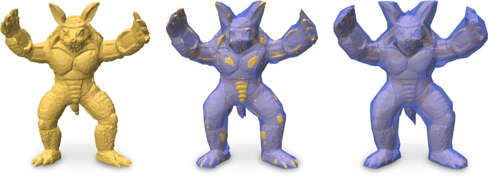

<br><br><br>

# Strictly Conservative Neural Implicits

### Pacific Graphics 2024

Strictly Conservative Neural Implicits is a method to convert 3D shapes into neural implicit form such that the shape is approximated in a guaranteed conservative manner. This means the input shape is strictly contained inside the neural implicit or, alternatively, vice versa. Such conservative approximations are of interest in a variety of applications, including collision detection, occlusion culling, or intersection testing.

Strictly Conservative Neural Implicits is described in more detail in the below publication.

# Citation

If you find this code useful, please consider citing our paper
```
@article{StrictlyConservativeNeuralImplicits,
author = {Ludwig, I. and Campen, M.},
title = {Strictly Conservative Neural Implicits},
journal = {Computer Graphics Forum},
volume = {43},
number = {7},
year = {2024}
}
```

# Getting Started

### Install dependencies
1. Create a new Anaconda environment with python 3.11: 
```bash
conda create --name conservative_neural_implicits  python=3.11
```
2. Switch to the new environment:
```bash
conda activate conservative_neural_implicits    
```
3. Install Pytorch using the right command for your system found on https://pytorch.org/get-started/locally/
4. Install jupyter using:
```bash
conda install jupyter
```
4. Install Matplotlib:
```bash
conda install matplotlib
```

Depending on the system, the installation of additional packages might be necessary.

### Tetrahedron based input
For creating a strictly conservative neural implicit from a tetrahedral mesh, follow these steps:
1. Place your input mesh in the tet_meshes directory. Currently only the vtk format is supported. Not neccessary if you use the provided bunny tetrahedral mesh.
2. Create a directory for your run.
3. Copy training_template.ipynb from the template directory into your folder.
4. In training_template.ipynb in your folder, at "Data Settings" give the name of your vtk file (without postfix) and set type to "tet".
5. If you would like to use pretraining, set use_pretraining = True.
6. Run the notebook. 

At the beginning of the first run the dataset might be constructed and stored in the point_cache directory. Depending on the input shape this might take a while. The best and final neural implicit is saved in the form name_day-month-year_hh-mm-ss.npz, for example bunny_13-09-2024_14-59-53.npz. The intermediate neural implicits are saved as bunny_pretrained.npz, etc..

### Voxel based input
For creating a strictly conservative neural implicit from a voxel set, follow these steps:
1. Place your input voxel set in the binvox directory. Currently only the binvox format is supported. The binvox files used in our paper can be found accompanying the software for the paper "Neural Bounding" by Liu et al., found under https://github.com/wenxin-liu/neural_bounding.
2. Create a directory for your run.
3. Copy training_template.ipynb from the template directory into your folder.
4. In training_template.ipynb in your folder, at "Data Settings" give the name of your binvox file (without postfix) and set type to "voxel".
5. If you would like to use pretraining, set use_pretraining = True.
6. Run the notebook. 

Depending on the input shape this might take a while. The best and final neural implicit is saved in the form name_day-month-year_hh-mm-ss.npz, for example bunny_13-09-2024_14-59-53.npz. The intermediate neural implicits are saved as bunny_pretrained.npz, etc..

### Settings
The Settings can be changed in the "Data Settings" section and in the local setting blocks in the individual sections (at "Create Randomly Initialized Model", "Pretraining", "Create Affine Dataloader", "Optimization" and "Lambda Reduction").


# Acknowledgments

The authors thank Nicholas Sharp for publishing code that has in multiple ways been helpful for this work.